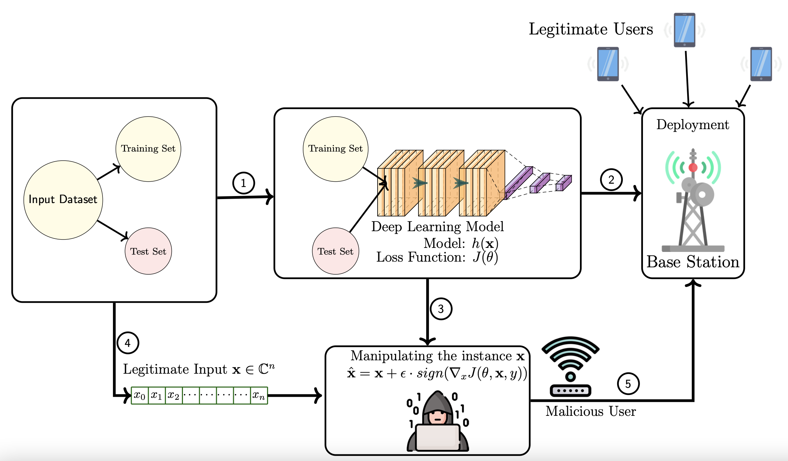

# 6G Security Research
Our 6G Security research outputs. We will share our papers and implementation to demonstrate the security vulnerabilities of deep learning based 6G solutions and their mitigation methods.

## Publications
The details of our **6G security** research are published in following the papers:
- [[Link]](https://www.researchgate.net/publication/350017366_Adversarial_Machine_Learning_Security_Problems_for_6G_mmWave_Beam_Prediction_Use-Case) Catak, Evren, Ferhat Ozgur Catak, and Arild Moldsvor. "Adversarial Machine Learning Security Problems for 6G: mmWave Beam Prediction Use-Case." *arXiv preprint arXiv:2103.07268* (2021). 
- [[Link]](https://www.researchgate.net/publication/351437476_Security_Concerns_on_Machine_Learning_Solutions_for_6G_Networks_in_mmWave_Beam_Prediction) Ferhat Ozgur Catak, Evren Catak, Murat Kuzlu and Umit Cali. "Security Concerns on Machine Learning Solutions for 6G Networks in mmWave Beam Prediction." *arXiv preprint arXiv:2105.03905* (2021). 

## Implementations
- [[Link]](6g-ai-security.ipynb) Adversarial Machine Learning Security Problems for 6G: mmWave Beam Prediction Use-Case

